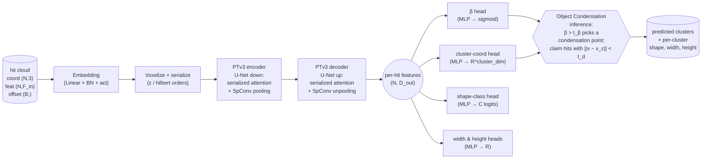

# Architecture

High-level data flow through the model. Per-run details (exact layer
widths, parameter counts) are written into
`<log_dir>/architecture/architecture.md` by `scripts/train.py`.

## Blocks

**Embedding.** A `Linear(F_in → C_0)` + BatchNorm + GELU that lifts the
raw per-hit features into the encoder width `C_0 = enc_channels[0]`.
For the shapes dataset `F_in = 3` (RGB).

**PTv3 backbone.** A U-Net of serialized-attention blocks:
- *Encoder stages* progressively halve the voxel resolution via
  `SerializedPooling` (SpConv-backed) and double the width.
  Each stage is `enc_depths[s]` transformer blocks with
  `enc_num_head[s]` attention heads on patches of size
  `enc_patch_size[s]`.
- *Decoder stages* unpool back up, skip-connecting encoder outputs.
- Points are ordered along one of several space-filling curves
  (`z`, `z-trans`, `hilbert`, `hilbert-trans`) before attention, which
  is the key permutation-invariance trick that lets the model scale.

**Object Condensation heads.** Three MLP heads on top of the per-hit
decoder features:
1. `β` (scalar, sigmoid): condensation likelihood.
2. `x` (vector in `R^cluster_dim`): cluster coordinates.
3. `pid_logits` (`C` classes): shape/particle classification.

Plus two scalar regressors for the shapes task (`width`, `height`) or
`energy` / `momentum` (3-vector) for the physics task — flags in the
config.

## Inference procedure (Object Condensation)

Per-event, run once at eval time:

1. Sort hits by descending `β`.
2. For each hit with `β > t_β` that is not yet assigned: mark it a
   condensation point. Assign all unassigned hits within
   `‖x − x_c‖ < t_d` (Euclidean in cluster-coord space) to this
   condensation point's cluster.
3. Stop when no unassigned hits with `β > t_β` remain. Anything
   unclaimed is predicted noise.

Per-cluster outputs (shape class, width, height) are aggregated from
the cluster's hit-level predictions — e.g. majority vote for the class
and mean for the scalars.

## Why this factoring?

- PTv3 is **permutation-invariant by construction** and handles
  variable-size point clouds natively, so heterogeneous subdetector
  tokens can share one backbone.
- Object Condensation gives **grid-free, variable-cardinality output**
  in a single forward pass — no NMS, no anchor tuning, no fixed upper
  bound on the number of objects per event.

## References

- Wu et al., *Point Transformer V3: Simpler, Faster, Stronger*, CVPR 2024.
- Kieseler, *Object condensation: one-stage grid-free multi-object
  reconstruction*, Eur. Phys. J. C 80, 886 (2020).
